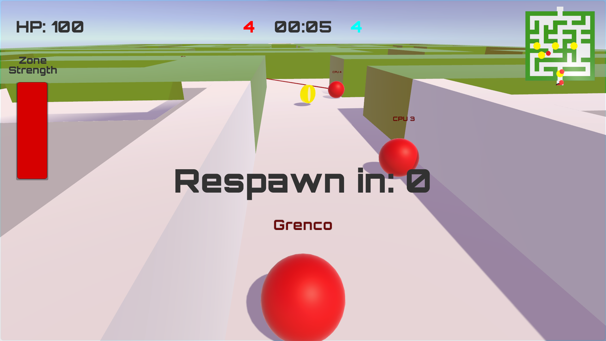
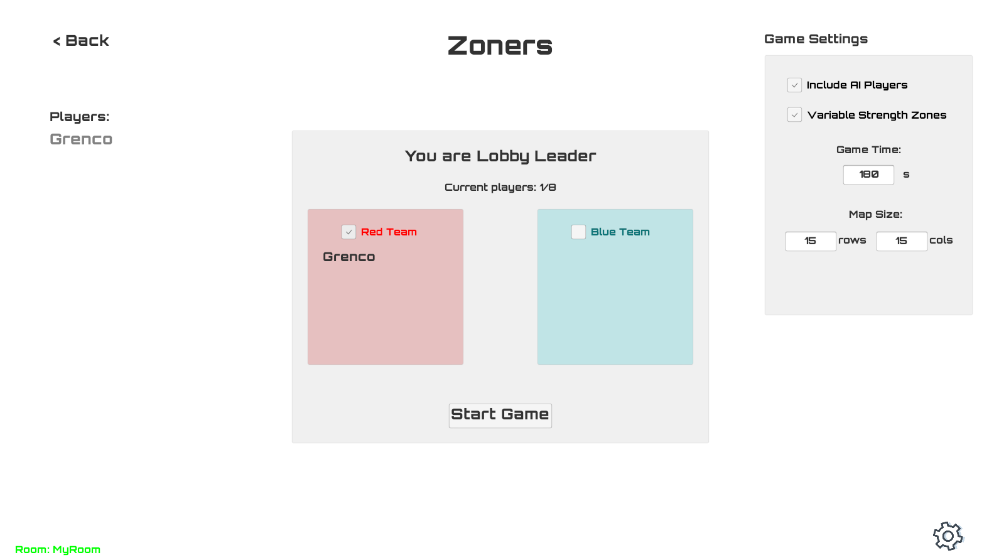

# Zoners
This is a Unity project I have been working on for fun in my free time. I have decided to no longer work on the game, all of the source code is now available for anyone to play around with or work on.

Zoners is a 4v4 online game which challenges players to trap the opposing team in your danger zone.

## Gameplay
Work together with your teammates to use your zone to damage the opposing team. But don't get greedy, because the bigger your zone, the less damage it does.

Every game is different, as the map is randomly generated at the start of the game.

Dying will put you on a 5-second cooldown, and if 2 players die at the same time your team will have no zone to work with. You get one point each time you kill one of the other team members, try to score the most points before time runs out.

Powerups will randomly spawn in the map (shown as a yellow spot on the minimap). These will either double the strength of your team's zone or give you a speed boost.

To start a game, just input your name and a room code, and you will be matched with up to 7 other players with the same room code. AI players are automatically added to teams of less than 4.

  
   

## Setup
Zoners uses Photon Unity Network (PUN) to host games over the network. To set up the game in Unity, you must first set up PUN, a guide to this can be found [here](https://doc.photonengine.com/en-us/pun/current/getting-started/initial-setup "PUN Setup Guide"). 

After building the project, you can then share the game binaries with friends and play together.

## Project setup
All game logic is written in C# and stored in the [scripts folder](Assets/Scripts "Scripts Folder").
